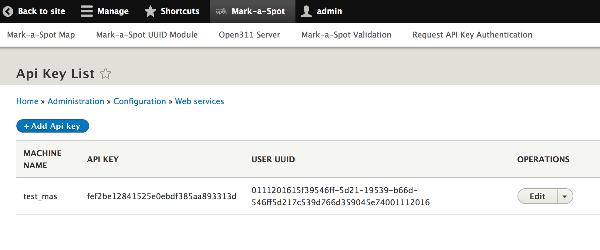

# Georeport v2 API

Open311 is a form of technology that provides open channels of communication for issues that concern public space and public services. Primarily, Open311 refers to a standardized protocol for location-based collaborative issue-tracking.

By offering free web API access to an existing 311 service, Open311 is an evolution of the phone-based 311 systems that many cities in North America offer.

#### API Key

If you install Mark-a-Spot, there is an API Key and a test-user preconfigured. You can add more keys for your users by clicking `Mark-a-Spot` in the black toolbar and `Request API Key Authentication`.

.

#### GeoReport v2 API Specification
Please check out the docs at [open311.org]('http://wiki.open311.org/GeoReport_v2/')

#### Change some discovery properties

GeoReport v2 and subsequent Open311 APIs are also required to have a standard service discovery file associated with them to provide routing between versions and types of APIs. You can configure the properties via the Open311 settings page.

.


#### Testing the API
Mark-a-Spot comes with a built-in GeoReport v2 Server. See how it works:
1. Go straight to the  Api Key Auth Provider copy the API Key.
2. Open a shell paste the command replacing the default API Key "abcdef123456". 
3. Watch how content has been created on the Service-Request page.

```
curl -w %{time_connect}:%{time_starttransfer}:"time-total: "%{time_total}"sec " -H "Application wwww-form-urlencoded" -i -d "media_url="http://mas-dev-krankwzhzdz4m.eu.platform.sh/sites/default/files/2016-10/wildermuell-tonal-decay-realname_CCBY.jpg"&service_code=0001&description=Elementaque phoebe surgere pondus. Partim lucis. 
Illic illi otia emicuit. Iudicis est adhuc hanc elementaque cognati sponte recens mundo. Vis nebulas fert solum sidera adhuc turba iudicis.
Campos circumfuso vix retinebat quam dei summaque. 
Tempora flexi diu convexi timebat vindice obliquis perveniunt montes.
&email=holger@markaspot.org&lat=40.7251976361&long=-73.9812576771
&api_key=abcdef123456" http://markaspot.docksal/georeport/v2/requests.json
```
