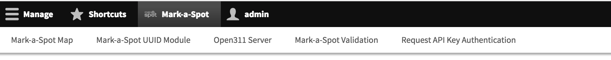
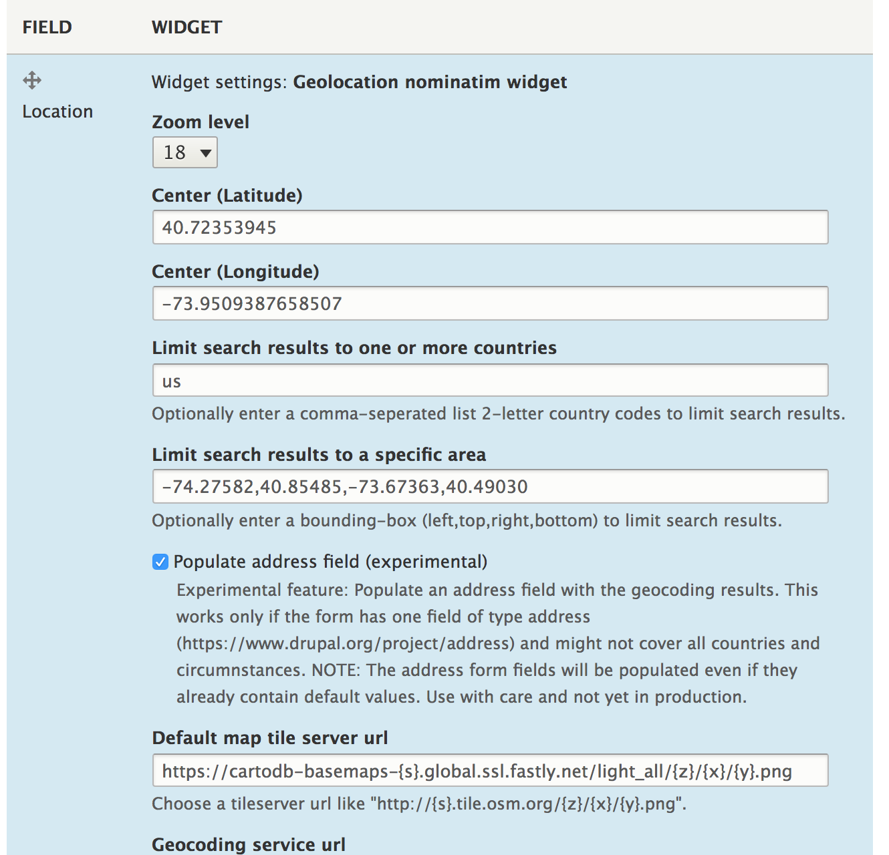
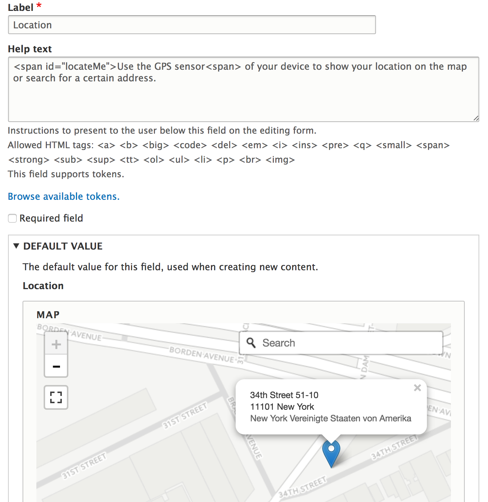
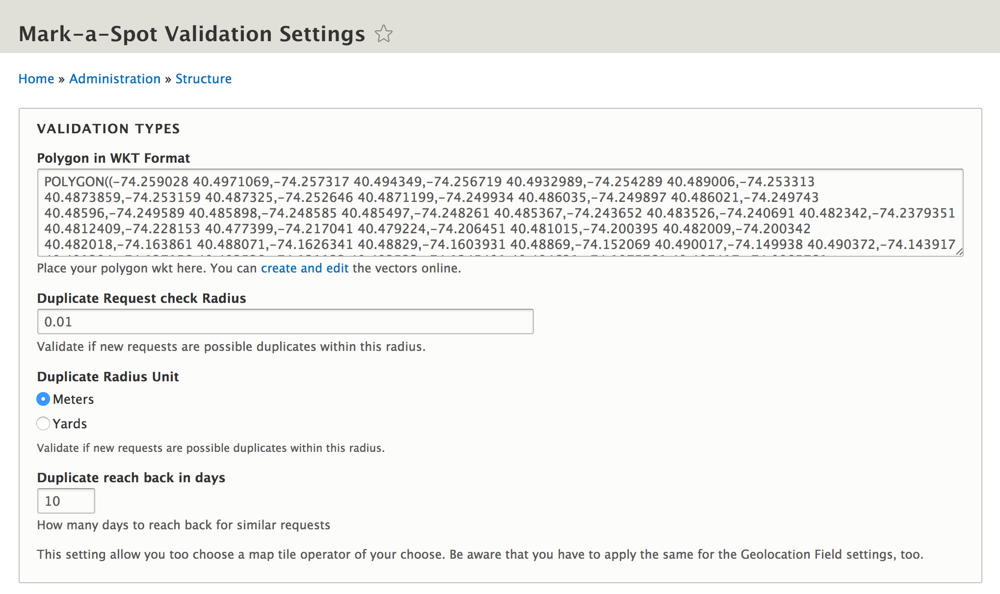
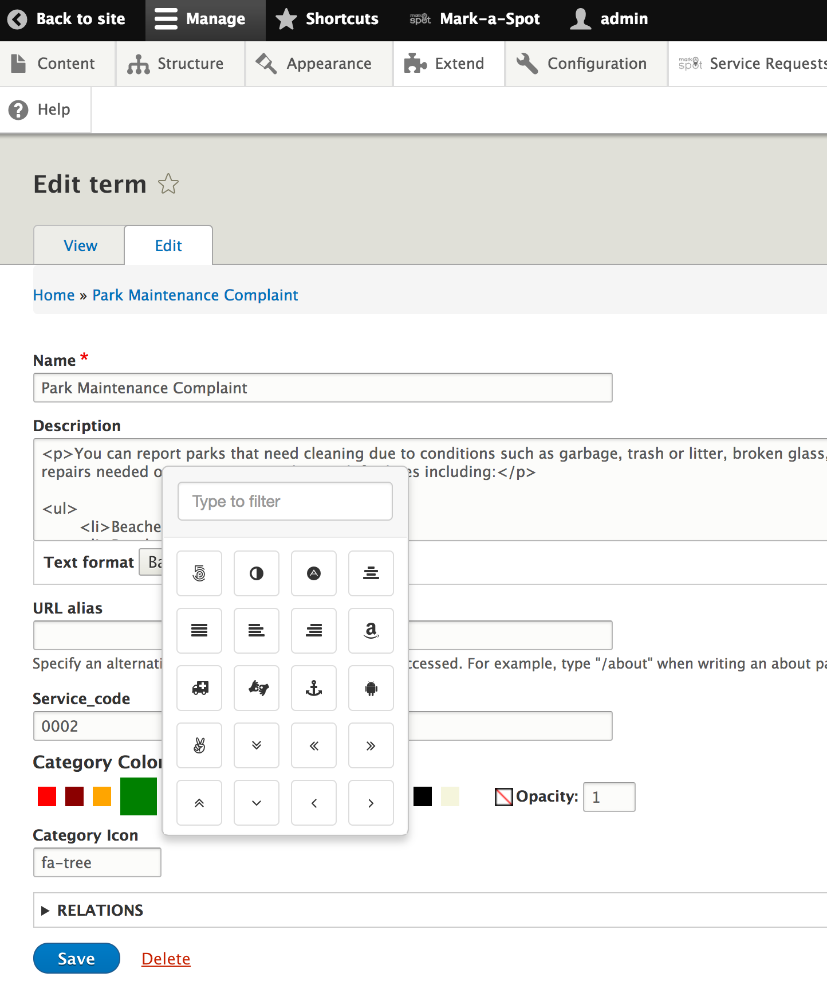

## Configuring Mark-a-Spot

Mark-a-Spot starts with some default content and configuration that takes the developer to a scenario of a public civic issue tracking in New York. 

You can turn this easily to any crowdsourcing/mapping use-case everywhere. Drupal empowers you to add other features to your website like pages, tag content with keywords or ask users for additional input like name or phone-number.

### Login as administrator

Point your browser to `http://markaspot.docksal/user`. Login with the credentials of the installation shell output.

Some settings are Drupal specific, some of Mark-a-Spot's configuration can be reached via it's toolbar.

Start with Drupal specific configuration by clicking on `Manage`.
You can now edit the service request content type in order to define all parameters needed to add content to the platform.

### Define Location services
#### Change the default Location
Mark-a-Spot offers a lightweighted form with a map widget, which needs to be configured. Go to `Manage` `Structure` `Content types` `Structure` `Service Request` and click on the `Manage form display` tab.

Check the `Location` Widget and the settings cog. You should prepare a starting point/adress. Visit your favorite map platform and find a central place within the desired area.

Now edit the location widget: Copy the latitude and longitude value of your desired center and paste the values into the center fields.
.

You may limit the street search results to a specific country or bounding box.

Edit the Location field:
.

### Validation

#### Change the valid region
Mark-a-Spot validates user input and restricts points to a valid area. This is useful, in case you set up your site for a specific city.
Click on the Mark-a-Spot link in the toolbar. Click `Mark-a-Spot validation`.

You will be able to edit the polygon within valid service requests can be placed.

.
#### Duplicate Check
Duplicate Posts are prevented by checking for similar points within a specific radius.

### Customize appearance

Besides customizing the theme by Drupal theming standards you can change logo, favicon and some basic settings from within the browser:

##### Color
You can adjust the color scheme. `Appearance` > `MasRadix` > `Settings`

##### Hero
You can [soon] add a hero or background image `Appearance` > `MasRadix` > `Settings`
...

##### Subtheme

If you need customization that need to override css or require sass code you can also add a subtheme and define masradix as a base theme. Please check out the [documentation at drupal.org](https://www.drupal.org/docs/8/theming-drupal-8/creating-a-drupal-8-sub-theme-or-sub-theme-of-sub-theme) for details.

### Structuring content

Drupal is a content management which helps structuring your information with different features. You already have learned about content types. Those can be referenced by taxonomies which categorize or tag content. Mark-a-Spot uses taxonomies for categories. 

##### Category
You can change color, icons and the category name by clicking `Structure` > `Taxonomy` > `Category` Klick `List terms` Then edit the terms.

.

##### Status 
You can enable and disable the display of the different status by checking the box at `Appearance` > `MasRadix` > `Settings`. Scroll down to the Checkbox.

If you want to edit the different status, like adding more terms then `open` and `closed`go to 
 `Structure` > `Taxonomy` > `Status`.
 
 Click `List terms` Then edit the terms. You can change Term-name, Icon and Colors

##### Organisation
This vocabulary was introduced in 8.4 and lets you structure content by jurisdiction or departments.

### Request ID Configuration
You can specify the #ID pattern of map content (service requests) which will be reflected in the title (category + #id) and the URL of the content created. 

#### Offset
If you want to migrate content from a different system and not starting counting your content id at 1, you can define an negative offset (-[last id]). If you test with a brand new installation and want to start counting at #1, enter a positive offset.

## Site configuration and settings
All Drupal typical settings and configuration options will not be aplified here. There a thousands of better sources for that, which will help you. If you need help for commercial support, don't hesitate to contact us.

### Map Configuration
The map visualization is capsulated in a single module which loads all neccessary libraries, like leaflet and waypoint. It also relies on views infinite scroll to be able to scroll down the list of content and have all points shown in the top list. Developers can easily change the behaviour by adopting the map container to the theme. 

Any other markup created by your view can be used. The connection to the module can be configured.

### Map Settings page

